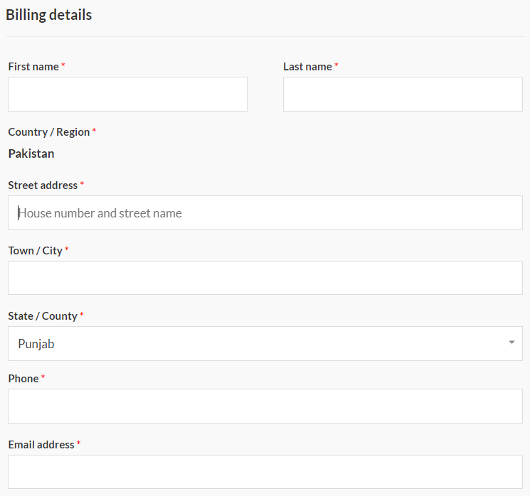

# Postal Code Removal For WooCommerce
### Description

This Is A Lightweight Plugin That Removes The Postal Code Field Present In The Checkout Page Of WooCommmerce. Just Activating This Plugin Will Remove The Postal Code Field From WooCommerce Checkout Page. This Plugin Is Totally Free For Commercial Use. 

### Details

Contributors: abidwaqar98

Donate link: https://www.buymeacoffee.com/abidwaqar

Tags: postal, code, removal, for, woocommerce, postcode, postalcode, postcoderemoval, postalcoderemoval, postalcoderemovalforwoocommerce, postcoderemovalforwoocommerce

Requires at least: 4.7

Tested up to: 5.4

Stable tag: 4.3

Requires PHP: 7.0

License: GPLv2 or later

License URI: https://www.gnu.org/licenses/gpl-2.0.html

### FAQs

##### Is This Plugin Lightweight?

Yes

##### Is This Plugin Free

Yes

### Screenshots

##### This Screenshot Is Taken Before Activating This Plugin

##### This Screenshot Is Taken After Activating This Plugin

### Changelog

##### 1.0

* Everything Is Up To Date

### Upgrade Notice

##### 1.0
This Version Makes This Plugin More Lightweight And Robust.